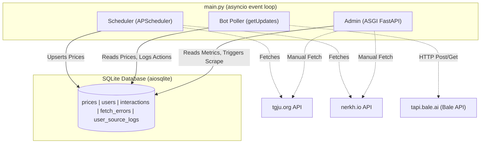

# Currency Rate Bale Bot 🤖💹

A Bale Messenger bot that fetches real-time Iranian currency, gold, and coin prices from two independent data sources ([tgju.org](https://tgju.org) and [nerkh.io](https://nerkh.io)), caches them locally in an SQLite database, and serves them to users via an interactive inline-keyboard interface. An admin dashboard (FastAPI + Jinja2) provides live monitoring.

---

## Table of Contents

- [Features](#features)
- [Architecture Overview](#architecture-overview)
- [Project Structure](#project-structure)
- [Data Sources](#data-sources)
- [Tracked Assets](#tracked-assets)
- [Bot Commands & Interactions](#bot-commands--interactions)
- [Admin Dashboard](#admin-dashboard)
- [Database Schema](#database-schema)
- [Prerequisites](#prerequisites)
- [Getting Started](#getting-started)
  - [Run Locally (Without Docker)](#run-locally-without-docker)
  - [Run with Docker (Recommended)](#run-with-docker-recommended-for-production)
- [Configuration Reference](#configuration-reference)
- [Running Tests](#running-tests)
- [Security Notes](#security-notes)
- [Contributing](#contributing)

---

## Features

| Feature | Description |
|---|---|
| **Dual Data Sources** | Fetches from both `tgju.org` (free, public) and `nerkh.io` (token-authenticated). Users can switch between sources per-session. |
| **Concurrent Fetching** | Uses `asyncio.gather` to fetch from both APIs simultaneously every N minutes (default: 5). |
| **SQLite Caching** | All fetched prices are upserted into a local SQLite database with WAL journal mode for concurrent reads. |
| **Farsi Localization** | All numbers are converted to Persian (Eastern Arabic) numerals. Prices are displayed in Toman (Rial ÷ 10). |
| **Interactive Keyboard** | Bale inline keyboards for navigating between categories (currency, gold, coin) and refreshing data. |
| **Per-user Source Preference** | Each user's preferred data source (tgju/nerkh) is persisted in the database. |
| **Admin Dashboard** | FastAPI + Jinja2 dashboard at `http://localhost:8080` with HTTP Basic Auth, showing stats, recent users, fetch errors, and source-change logs. |
| **Manual Scrape Trigger** | The admin dashboard has a "Manual Update" button that immediately triggers a fresh fetch from both APIs. |
| **Interaction Logging** | Every command and button press is logged to the `interactions` table for analytics. |
| **Error Logging** | Fetch failures from each source are logged to the `fetch_errors` table and shown in the admin panel. |
| **Dockerized** | Single-container Docker setup via `docker-compose`. SQLite database is persisted via a bind mount. |

---

## Tech Stack

- **Core Language**: Python 3.12+
- **Concurrency**: `asyncio` for simultaneous fetching and bot operations
- **Database**: SQLite (via `aiosqlite` with WAL journal mode)
- **Admin Dashboard**: FastAPI + Jinja2 Templates (with Tailwind CSS styling)
- **Task Scheduling**: APScheduler (for periodic price updates)
- **Configuration**: Pydantic Settings
- **Testing**: Pytest, pytest-asyncio, aioresponses
- **Deployment**: Docker, Docker Compose

---

## Architecture Overview



All three services (scheduler, bot poller, admin HTTP server) run as concurrent `asyncio` tasks inside the same Python process.

---

## Project Structure

```
.
├── main.py                     # Entry point: wires all services together
├── requirements.txt            # Python dependencies
├── Dockerfile                  # Single-stage Docker image (python:3.12-slim)
├── docker-compose.yml          # Production compose config
├── .env.example                # Template for environment variables
├── .gitignore
├── .dockerignore
├── nerkh-io-README.md          # Nerkh.io API reference / cURL examples
├── data/
│   └── bot.db                  # SQLite database (git-ignored, bind-mounted in Docker)
├── template-codes/             # Historical/reference sender scripts (not used in production)
│   ├── sender.py
│   ├── sender_2.py
│   └── sender_3.py
├── src/
│   ├── config.py               # Pydantic-settings: reads from .env
│   ├── admin/
│   │   ├── app.py              # FastAPI app, routes, auth
│   │   └── templates/
│   │       └── dashboard.html  # Jinja2 admin dashboard (RTL, Tailwind CSS)
│   ├── bot/
│   │   ├── client.py           # BaleClient: raw HTTP wrapper around tapi.bale.ai
│   │   ├── handlers.py         # Message and callback_query handlers
│   │   ├── formatters.py       # Price formatting: commas, Persian digits, emojis
│   │   ├── keyboards.py        # Inline keyboard builders
│   │   └── poller.py           # Long-poll loop (getUpdates)
│   ├── database/
│   │   ├── connection.py       # aiosqlite connection factory + init_db()
│   │   └── repositories.py     # Data-access layer (PriceRepository, UserRepository, …)
│   └── services/
│       ├── tgju_fetcher.py     # Fetches & normalizes data from tgju.org
│       ├── nerkh_fetcher.py    # Fetches & normalizes data from nerkh.io
│       ├── price_service.py    # Orchestrates concurrent fetch + DB upsert
│       └── scheduler.py        # APScheduler wrapper: runs fetch_and_store() on interval
└── tests/
    ├── conftest.py             # Shared fixtures (in-memory DB, HTTP mocks, sample data)
    ├── test_tgju_fetcher.py
    ├── test_nerkh_fetcher.py
    ├── test_formatters.py
    ├── test_keyboards.py
    ├── test_repositories.py
    ├── test_handlers.py
    ├── test_bale_client.py
    ├── test_price_service.py
    ├── test_admin.py
    ├── test_tgju_scraper.py    # Live scraper smoke test (skipped if no network)
    └── test_nerkh_scraper.py   # Live scraper smoke test (skipped if no token)
```

---

## Data Sources

### 1. TGJU (`tgju.org`)
- **Endpoint:** `https://call2.tgju.org/ajax.json`
- **Auth:** None — public, no token required.
- **Key:** `current` object inside the JSON, keyed by asset symbol (e.g. `price_dollar_rl`).
- **Price unit:** Rial — divided by 10 to get Toman (except gold ounce, which is USD).
- **Configurable via:** `TGJU_URL` env var.

### 2. Nerkh.io (`nerkh.io`)
- **Endpoint:** `https://api.nerkh.io/v1/prices/json/all`
- **Auth:** Bearer token (`Authorization: Bearer <NERKH_API_TOKEN>`).
- **Response structure:** `{ "data": { "currencies": {...}, "golds": {...}, "coins": {...} } }`.
- **Price unit:** Rial — divided by 10 for Toman (except gold ounce, which is USD).
- **Configurable via:** `NERKH_URL` + `NERKH_API_TOKEN` env vars.
- **If token is absent:** The Nerkh fetcher is silently skipped; TGJU data remains available.
- **Reference:** See [`nerkh-io-README.md`](nerkh-io-README.md) for full API examples.

---

## Tracked Assets

| Internal Code | Farsi Name | Category | Source Symbols |
|---|---|---|---|
| `usd` | دلار آمریکا | currency | `price_dollar_rl` / `USD` |
| `eur` | یورو | currency | `price_eur` / `EUR` |
| `aed` | درهم امارات | currency | `price_aed` / `AED` |
| `gbp` | پوند انگلیس | currency | `price_gbp` / `GBP` |
| `gold_18k_sell` | طلای ۱۸ عیار (فروش) | gold | `tgju_gold_irg18` / `GOLD18K` |
| `gold_18k_buy` | طلای ۱۸ عیار (خرید) | gold | `tgju_gold_irg18_buy` *(TGJU only)* |
| `mesghal` | مثقال طلا | gold | `mesghal` / `MAZANEH` |
| `ounce` | انس جهانی طلا | gold | `ons` / `OUNCE` *(price in USD)* |
| `coin_emami` | سکه امامی | coin | `sekee` / `SEKE_EMAMI` |
| `coin_bahar` | سکه بهار آزادی | coin | `sekeb` / `SEKE_BAHAR` |
| `coin_nim` | نیم سکه | coin | `nim` / `SEKE_NIM` |
| `coin_rob` | ربع سکه | coin | `rob` / `SEKE_ROB` |
| `coin_gerami` | سکه گرمی | coin | `retail_gerami` / `SEKE_1G` |

> **Note:** `gold_18k_buy` is only available from the TGJU source. Nerkh.io provides a single 18K gold price.

---

## Bot Commands & Interactions

The bot operates entirely through **inline keyboards** — users never need to type commands manually after the first start. All interactions are logged.

| Trigger | Description |
|---|---|
| `/start` or any unrecognized text | Greets the user and shows the main menu keyboard. |
| `/price` | Directly shows all prices for the user's preferred source. |
| **[💵 ارز]** button | Shows only currency prices (USD, EUR, AED, GBP). |
| **[✨ طلا]** button | Shows only gold prices. |
| **[🪙 سکه]** button | Shows only coin prices. |
| **[📊 همه قیمت‌ها]** button | Shows all prices grouped by category. |
| **[⚙️ منبع قیمت‌ها]** button | Opens source selection menu. |
| **[TGJU / ✅ TGJU]** button | Switches user's preferred source to TGJU. |
| **[Nerkh.io / ✅ Nerkh.io]** button | Switches user's preferred source to Nerkh.io. |
| **[🔄 بروزرسانی]** button | Re-fetches and displays the current category from cache. |
| **[🔙 بازگشت به منوی اصلی]** button | Returns to the main menu. |

> All text messages sent to the bot (other than `/start` and `/price`) are treated as a `/start` trigger — the bot responds with the welcome message and main menu.

---

## Admin Dashboard

The dashboard is available at `http://localhost:<ADMIN_PORT>` (default: `8080`) and requires HTTP Basic Auth.

**Displays:**
- **Total users** and **active users** (active = interacted within the last 24 hours).
- **Most-used command** with usage count.
- **Price source status**: number of cached assets per source (TGJU / Nerkh).
- **Last fetch timestamp**.
- **Recent users table** (up to 50): Bale ID, name, username, last activity.
- **Recent fetch errors table** (up to 20): source, error type, time, error message.
- **Source change log** (up to 20): which user switched from which source to which.
- **Manual scrape button**: triggers an immediate fetch from both APIs (`POST /api/scrape`).
- **Auto-refresh**: the page reloads itself every 60 seconds.

**API endpoint:**
```
POST /api/scrape    — triggers fetch_and_store() immediately (requires auth)
```

---

## Database Schema

The SQLite database is stored at `data/bot.db` (configurable via `DB_PATH`). WAL journal mode is enabled for better read concurrency.

```sql
-- Cached prices from all sources
CREATE TABLE prices (
    asset_code       TEXT,              -- e.g. 'usd', 'gold_18k_sell'
    asset_name_fa    TEXT NOT NULL,     -- Farsi display name
    category         TEXT NOT NULL,     -- 'currency' | 'gold' | 'coin'
    price            TEXT NOT NULL,     -- Current price in Toman (or USD for ounce)
    price_high       TEXT,             -- 12-hour high
    price_low        TEXT,             -- 12-hour low
    change_amount    TEXT,             -- Absolute change value
    change_percent   REAL,             -- Percentage change
    change_direction TEXT,             -- 'high' | 'low' | 'stable'
    source           TEXT NOT NULL,    -- 'tgju' | 'nerkh'
    source_timestamp TEXT,             -- Timestamp from the source API
    fetched_at       TIMESTAMP DEFAULT CURRENT_TIMESTAMP,
    PRIMARY KEY (asset_code, source)   -- One row per asset per source
);

-- Registered bot users
CREATE TABLE users (
    user_id          INTEGER PRIMARY KEY,   -- Bale user ID
    first_name       TEXT,
    last_name        TEXT,
    username         TEXT,
    preferred_source TEXT DEFAULT 'tgju',   -- Last chosen data source
    first_seen_at    TIMESTAMP DEFAULT CURRENT_TIMESTAMP,
    last_seen_at     TIMESTAMP DEFAULT CURRENT_TIMESTAMP
);

-- Audit log of user source switches
CREATE TABLE user_source_logs (
    id          INTEGER PRIMARY KEY AUTOINCREMENT,
    user_id     INTEGER NOT NULL REFERENCES users(user_id),
    old_source  TEXT,
    new_source  TEXT NOT NULL,
    changed_at  TIMESTAMP DEFAULT CURRENT_TIMESTAMP
);

-- Every command / button press
CREATE TABLE interactions (
    id         INTEGER PRIMARY KEY AUTOINCREMENT,
    user_id    INTEGER NOT NULL REFERENCES users(user_id),
    command    TEXT NOT NULL,   -- e.g. '/start', 'btn:all', 'btn:cat:gold'
    created_at TIMESTAMP DEFAULT CURRENT_TIMESTAMP
);

-- Fetch errors from tgju / nerkh
CREATE TABLE fetch_errors (
    id            INTEGER PRIMARY KEY AUTOINCREMENT,
    source        TEXT NOT NULL,      -- 'tgju' | 'nerkh'
    error_message TEXT NOT NULL,
    error_type    TEXT,               -- Python exception class name
    created_at    TIMESTAMP DEFAULT CURRENT_TIMESTAMP
);
```

---

## Prerequisites

| Requirement | Version | Notes |
|---|---|---|
| Python | 3.12+ | Only needed for local (non-Docker) runs |
| Docker + Docker Compose | Any recent | Recommended for production |
| Bale Bot Token | — | Obtain from BotFather in Bale Messenger |
| Nerkh.io API Token | — | Obtain from [nerkh.io](https://nerkh.io) (optional — bot works without it using TGJU only) |

---

## Getting Started

### 1. Clone the repository

```bash
git clone <your-repo-url>
cd "Currency Rate Bale Bot"
```

### 2. Configure environment variables

```bash
cp .env.example .env
```

Edit `.env` and fill in at minimum:

```env
BOT_TOKEN=your_bale_bot_token_here
NERKH_API_TOKEN=your_nerkh_io_token_here   # Optional — leave empty to use TGJU only
```

> ⚠️ **Obviously you should Never commit your real `.env` file.** It is already in `.gitignore`.

---

### Run Locally (Without Docker)

```bash
# Create and activate a virtual environment
python -m venv .venv
source .venv/bin/activate        # Windows: .venv\Scripts\activate

# Install dependencies
pip install -r requirements.txt

# Start the bot
python main.py
```

The bot will:
1. Initialize the SQLite database at `data/bot.db`.
2. Fetch prices from both sources immediately on startup.
3. Continue fetching every `FETCH_INTERVAL_MINUTES` minutes (default: 5).
4. Start listening for Bale messages via long-polling.
5. Serve the admin dashboard at `http://localhost:8080`.

---

### Run with Docker (Recommended for Production)

The Docker image must be built before using `docker-compose up`:

```bash
# Build the image
docker build -t currencyratebalebot:0.1.0 .

# Start the container in the background
docker-compose up -d

# View live logs
docker-compose logs -f bot

# Stop and remove the container
docker-compose down
```

The `data/` directory is bind-mounted into the container at `/app/data`, so the SQLite database persists across container restarts.

> **Tip:** If you update the code, rebuild the image first:
> ```bash
> docker build -t currencyratebalebot:0.1.0 . && docker-compose up -d
> ```

---

## Configuration Reference

All settings are read from environment variables (or `.env`). Defaults are shown below.

| Variable | Default | Required | Description |
|---|---|---|---|
| `BOT_TOKEN` | *(empty)* | **Yes** | Bale bot token from BotFather. |
| `NERKH_API_TOKEN` | *(empty)* | No | Bearer token for nerkh.io. If empty, Nerkh fetches are skipped. |
| `TGJU_URL` | `https://call2.tgju.org/ajax.json` | No | TGJU API endpoint. |
| `NERKH_URL` | `https://api.nerkh.io/v1/prices/json/all` | No | Nerkh.io API endpoint. |
| `BALE_API_URL` | `https://tapi.bale.ai/bot` | No | Bale Bot API base URL. |
| `FETCH_INTERVAL_MINUTES` | `5` | No | How often (in minutes) to fetch new prices. |
| `DB_PATH` | `data/bot.db` | No | Path to the SQLite database file. |
| `ADMIN_PORT` | `8080` | No | Port for the admin dashboard HTTP server. |
| `ADMIN_USERNAME` | `admin` | **Change in prod** | HTTP Basic Auth username for the admin panel. |
| `ADMIN_PASSWORD` | `admin` | **Change in prod** | HTTP Basic Auth password for the admin panel. |
| `LOG_LEVEL` | `INFO` | No | Python logging level: `DEBUG`, `INFO`, `WARNING`, `ERROR`. |

---

## Running Tests

The test suite uses `pytest` with `pytest-asyncio` and `aioresponses` for HTTP mocking. **No network calls and no file system artifacts** are produced during testing — all tests use a temporary in-memory SQLite database.

```bash
# Install dev dependencies (included in requirements.txt)
pip install -r requirements.txt

# Run all tests
pytest

# Run with verbose output
pytest -v

# Run a specific test file
pytest tests/test_formatters.py -v

# Run with coverage report
pytest --cov=src --cov-report=term-missing
```

### Test files

| File | What it tests |
|---|---|
| `test_tgju_fetcher.py` | TGJU API response parsing and price normalization |
| `test_nerkh_fetcher.py` | Nerkh.io response parsing, missing-token handling |
| `test_formatters.py` | Persian digit conversion, price formatting, change formatting |
| `test_keyboards.py` | Inline keyboard structure and callback data |
| `test_repositories.py` | All database repository methods against a temp DB |
| `test_handlers.py` | Bot message and callback handler logic with mocked DB/client |
| `test_bale_client.py` | BaleClient HTTP methods with mocked aiohttp |
| `test_price_service.py` | Concurrent fetch orchestration and error handling |
| `test_admin.py` | FastAPI admin panel routes and auth |
| `test_tgju_scraper.py` | Live smoke test against tgju.org (requires network) |
| `test_nerkh_scraper.py` | Live smoke test against nerkh.io (requires token + network) |

---

## Security Notes

- **Admin credentials:** The defaults (`admin`/`admin`) are intentionally weak. **Always change `ADMIN_USERNAME` and `ADMIN_PASSWORD` in production.**
- **Credential comparison:** The admin panel uses `secrets.compare_digest` to prevent timing attacks.
- **Non-root Docker user:** The container runs as an unprivileged `botuser` user — not `root`.
- **`.env` is git-ignored:** Your secrets are never committed. Only `.env.example` (with placeholder values) is tracked.
- **No external exposure required:** The bot uses Bale's long-polling mechanism, so no inbound webhook port needs to be opened to the internet.

---

## Contributing

See [CONTRIBUTING.md](CONTRIBUTING.md) for development workflow, coding conventions, and how to add a new asset or data source.
